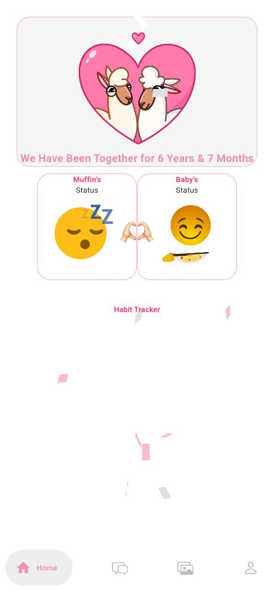
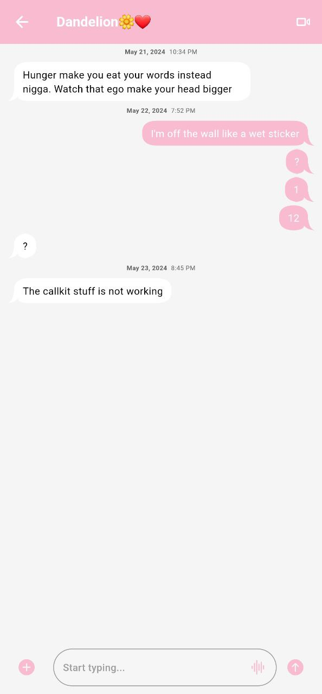
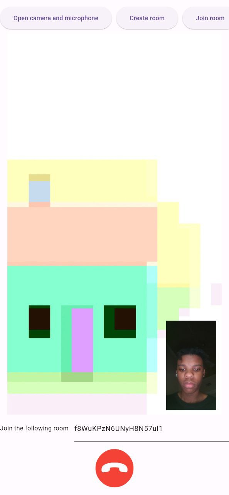
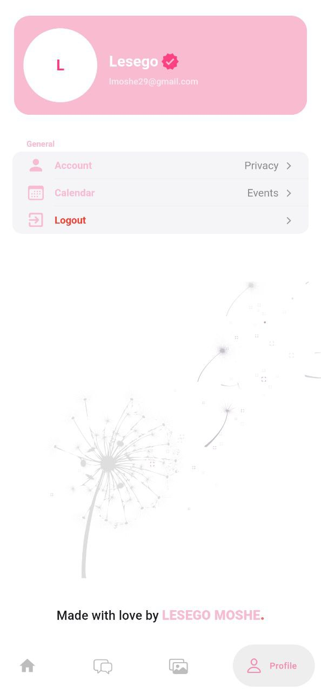

# Muffin's Happy Place

## Table of Contents

1. [Introduction](#introduction)
2. [Features](#features)
3. [Screenshots](#screenshots)
4. [Technology Stack](#technology-stack)

## Introduction

Muffin's Happy Place is a personal relationship app designed to enrich my romantic experience. With an emphasis on communication, shared activities, and special moments, this application combines various features to help my partner and I stay connected in a meaningful way.

This app was created with love and care and represents a unique combination of modern technology and personal sentiment. Whether it's tracking habits, dedicating music, or sharing important dates, Muffin's Happy Place brings everything I need to celebrate my relationship in one place.

## Features

Here's a detailed list of features that Muffin's offers:

- **Relationship Duration Indicator**: Track how long you and your partner have been together with a beautiful UI display.
- **Rich Chat Experience**: Communicate seamlessly with your partner using rich chat functionalities, including:
  - **Video and Audio Calls**: Powered by WebRTC for real-time communication.
  - **Media Sharing**: Share videos and images effortlessly, stored securely in Firebase.
- **Habit Tracker**: Use the Hive database to track and share habits, goals, and progress with your partner.
- **Music Dedication**: Dedicate songs to your partner using the **YouTube API**, creating a special musical connection.
- **Shared Calendar**: Keep track of important dates, anniversaries, and special occasions with a shared calendar feature.
  
## Screenshots

Here's a preview of the application:

  
  

## Technology Stack

- **Flutter**: Front-end framework for building beautiful native apps.
- **Firebase**: Backend services for authentication, real-time database, and cloud storage.
- **WebRTC**: Real-time communication for video and audio calls.
- **Hive**: Local database for habit tracking.
- **YouTube API**: Fetches and plays songs dedicated to your partner.

